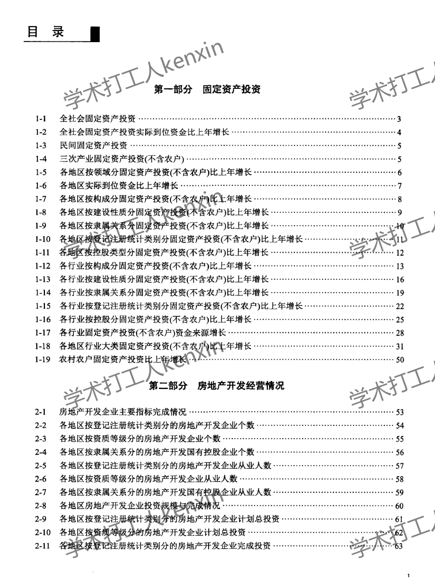
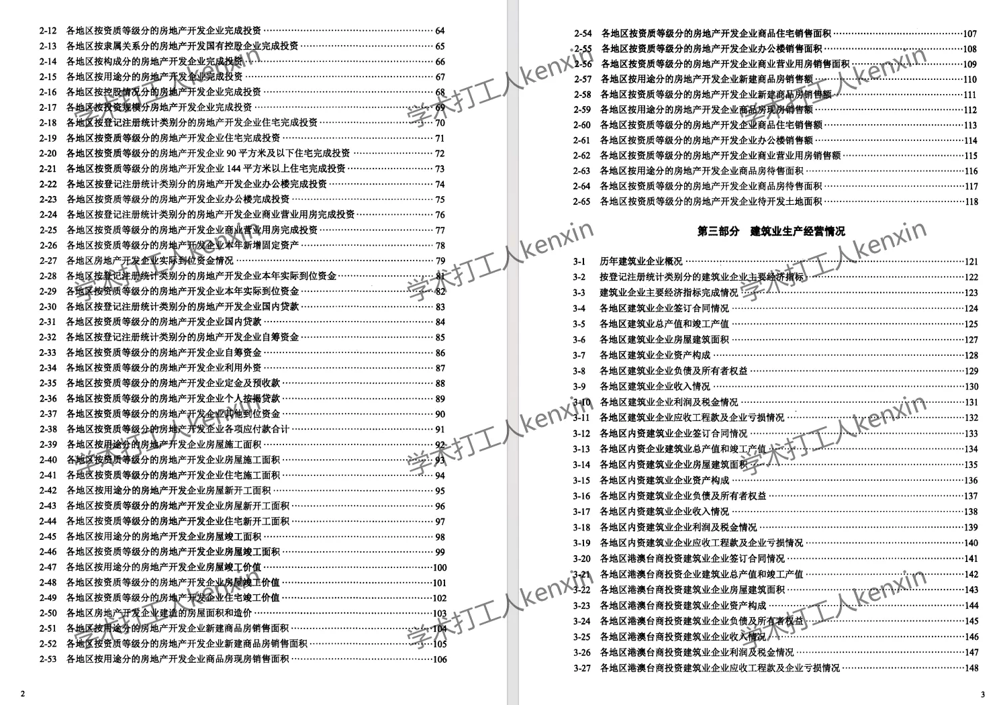
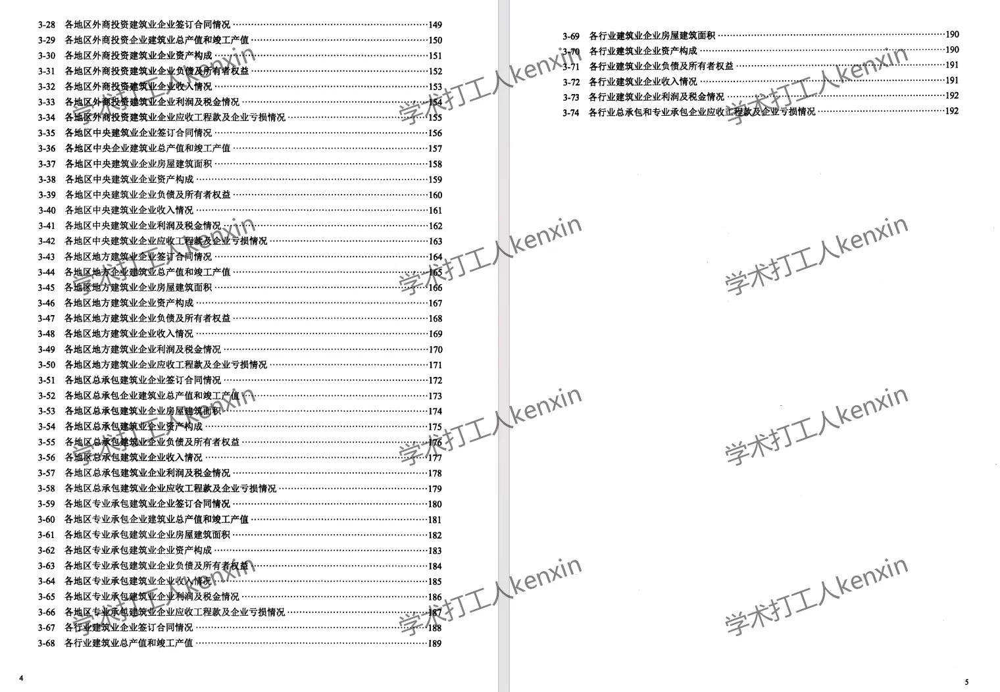
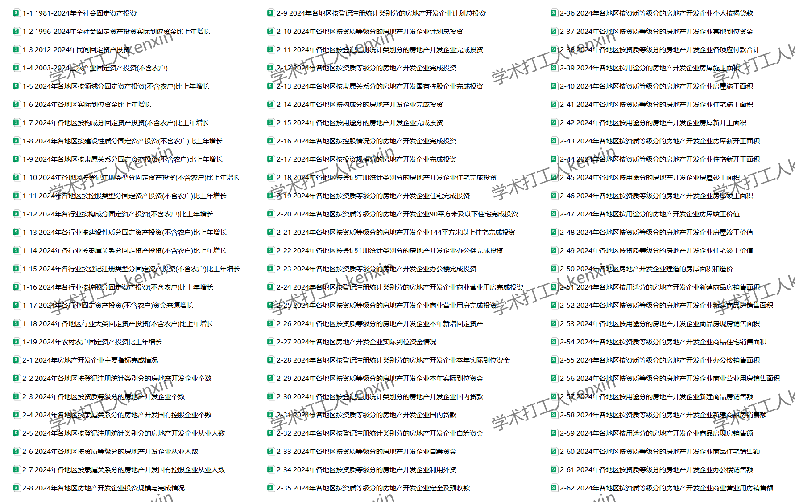
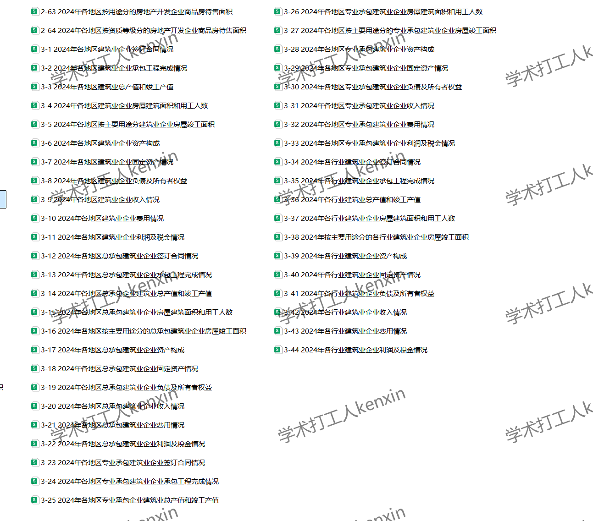
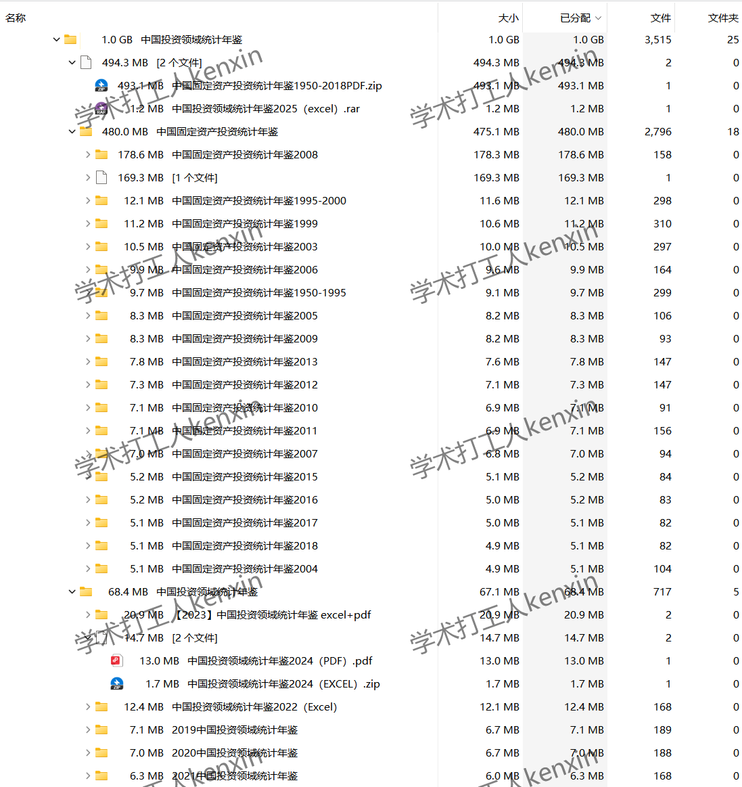

## Body

中国投资领域统计年鉴(1950-2025年）

数据年份：年鉴年份为1950-2025年（数据年份需要减一），01、02年未发布,2014未发布故而用2013年固定资产投资统计年报pdf进行替代。

01、数据简介
《中国投资领域统计年鉴》曾用名《中国固定资产投资统计年鉴》，2019-2025年改名为《中国投资领域统计年鉴》。

02、指标详情
目录已在图片展示，请自助查看，酌情购买，指标众多不帮忙找数据，都在这里，发货后不支持无理由退货。
展示目录为2024年与2025年，pdf格式的目录为2024年，excel格式的为2025年，内容众多，展示部分，可以使用搜索引擎事先了解目录内容，不同年份统计口径可能会变动，学术常识，望周知。

03.数据内容
格式：多为EXCEL，部分又pdf格式，文件放置位置图片已展示，请看清楚再拍，介意勿拍。

## Images

Here is a pay link on Stripe ( https://buy.stripe.com/3cs8yP7sY87d0vu9AB ). Please contact me lonlonago@foxmail.com after funding $89, and I will send you a complete data files , thank you!

